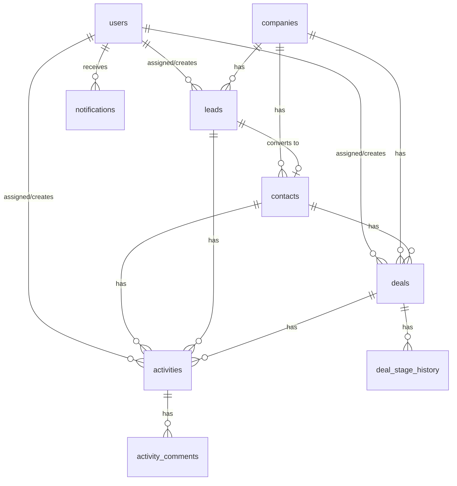

# Database Schema

## Overview

UnifiedCRM uses **Supabase** (managed PostgreSQL) as the database and backend. The schema uses **snake_case** column names (PostgreSQL convention). No multi-tenant/workspace tables — this is a single-instance demo.

Database access is through the **Supabase JS client** (`@supabase/supabase-js`). Types are generated via `supabase gen types typescript`.

## Entity Relationship Diagram



File attachments are handled by **Supabase Storage** (bucket: `attachments`). Attachment metadata is stored in the `attachments` table with a `storage_path` referencing the Supabase Storage object.

## Enums

Define these as PostgreSQL enums via Supabase SQL editor or migration:

```sql
CREATE TYPE user_role AS ENUM ('ADMIN', 'MANAGER', 'SALES', 'VIEWER');

CREATE TYPE lead_status AS ENUM ('NEW', 'CONTACTED', 'QUALIFIED', 'CONVERTED', 'LOST');

CREATE TYPE lead_source AS ENUM ('WEBSITE', 'REFERRAL', 'COLD_CALL', 'SOCIAL_MEDIA', 'EVENT', 'ADVERTISEMENT', 'OTHER');

CREATE TYPE deal_stage AS ENUM ('LEAD', 'QUALIFIED', 'PROPOSAL', 'NEGOTIATION', 'CLOSED_WON', 'CLOSED_LOST');

CREATE TYPE activity_type AS ENUM ('CALL', 'EMAIL', 'MEETING', 'TASK', 'NOTE', 'DEMO', 'FOLLOW_UP');

CREATE TYPE activity_result AS ENUM ('COMPLETED', 'NO_ANSWER', 'FOLLOW_UP_NEEDED', 'MEETING_SCHEDULED', 'DEAL_ADVANCED', 'CANCELLED', 'FAILED');

CREATE TYPE notification_type AS ENUM ('LEAD_ASSIGNED', 'LEAD_CONVERTED', 'DEAL_STAGE_CHANGED', 'DEAL_ASSIGNED', 'DEAL_CLOSED', 'DEAL_STALE', 'COMMENT_ADDED');

CREATE TYPE audit_action AS ENUM ('CREATE', 'UPDATE', 'DELETE', 'STAGE_CHANGE', 'ASSIGNMENT_CHANGE', 'STATUS_CHANGE', 'CONVERSION', 'ARCHIVE');

CREATE TYPE entity_type AS ENUM ('COMPANY', 'CONTACT', 'LEAD', 'DEAL', 'ACTIVITY', 'USER');
```

---

## Table Definitions

### 1. users

**Purpose:** Demo user accounts. Pre-seeded, not created at runtime.

```sql
CREATE TABLE users (
  id UUID PRIMARY KEY DEFAULT gen_random_uuid(),
  email TEXT UNIQUE NOT NULL,
  first_name TEXT NOT NULL,
  last_name TEXT NOT NULL,
  avatar_url TEXT,
  role user_role NOT NULL DEFAULT 'SALES',
  is_active BOOLEAN NOT NULL DEFAULT true,
  created_at TIMESTAMPTZ NOT NULL DEFAULT now(),
  updated_at TIMESTAMPTZ NOT NULL DEFAULT now()
);

CREATE INDEX idx_users_role ON users(role);
```

**Notes:** No `password_hash` — demo auth works by selecting a user account directly. The `role` field is directly on the user (no workspace join table).

---

### 2. companies

```sql
CREATE TABLE companies (
  id UUID PRIMARY KEY DEFAULT gen_random_uuid(),
  name TEXT NOT NULL,
  industry TEXT,
  website TEXT,
  phone TEXT,
  email TEXT,
  address TEXT,
  notes TEXT,
  created_by_id UUID NOT NULL REFERENCES users(id),
  created_at TIMESTAMPTZ NOT NULL DEFAULT now(),
  updated_at TIMESTAMPTZ NOT NULL DEFAULT now(),
  deleted_at TIMESTAMPTZ
);

CREATE UNIQUE INDEX idx_companies_name_unique ON companies(LOWER(name)) WHERE deleted_at IS NULL;
CREATE INDEX idx_companies_deleted_at ON companies(deleted_at);
CREATE INDEX idx_companies_industry ON companies(industry);
```

**Notes:**
- Unique constraint on `LOWER(name)` only for non-archived records (partial unique index).
- `deleted_at` is the soft-delete mechanism.

---

### 3. contacts

```sql
CREATE TABLE contacts (
  id UUID PRIMARY KEY DEFAULT gen_random_uuid(),
  first_name TEXT NOT NULL,
  last_name TEXT NOT NULL,
  email TEXT,
  phone TEXT,
  title TEXT,
  company_id UUID REFERENCES companies(id),
  source lead_source,
  created_by_id UUID NOT NULL REFERENCES users(id),
  created_at TIMESTAMPTZ NOT NULL DEFAULT now(),
  updated_at TIMESTAMPTZ NOT NULL DEFAULT now(),
  deleted_at TIMESTAMPTZ,
  CONSTRAINT contacts_email_or_phone CHECK (email IS NOT NULL OR phone IS NOT NULL)
);

CREATE INDEX idx_contacts_company_id ON contacts(company_id);
CREATE INDEX idx_contacts_deleted_at ON contacts(deleted_at);
```

---

### 4. leads

```sql
CREATE TABLE leads (
  id UUID PRIMARY KEY DEFAULT gen_random_uuid(),
  first_name TEXT NOT NULL,
  last_name TEXT NOT NULL,
  email TEXT,
  phone TEXT,
  source lead_source NOT NULL,
  status lead_status NOT NULL DEFAULT 'NEW',
  company_id UUID REFERENCES companies(id),
  assigned_to_id UUID REFERENCES users(id),
  converted_contact_id UUID REFERENCES contacts(id),
  converted_at TIMESTAMPTZ,
  notes TEXT,
  created_by_id UUID NOT NULL REFERENCES users(id),
  created_at TIMESTAMPTZ NOT NULL DEFAULT now(),
  updated_at TIMESTAMPTZ NOT NULL DEFAULT now(),
  deleted_at TIMESTAMPTZ,
  CONSTRAINT leads_email_or_phone CHECK (email IS NOT NULL OR phone IS NOT NULL)
);

CREATE INDEX idx_leads_status ON leads(status);
CREATE INDEX idx_leads_assigned_to ON leads(assigned_to_id);
CREATE INDEX idx_leads_source ON leads(source);
CREATE INDEX idx_leads_deleted_at ON leads(deleted_at);
CREATE INDEX idx_leads_created_at ON leads(created_at);
```

---

### 5. deals

```sql
CREATE TABLE deals (
  id UUID PRIMARY KEY DEFAULT gen_random_uuid(),
  title TEXT NOT NULL,
  value NUMERIC(12,2) NOT NULL DEFAULT 0,
  stage deal_stage NOT NULL DEFAULT 'LEAD',
  contact_id UUID NOT NULL REFERENCES contacts(id),
  company_id UUID REFERENCES companies(id),
  lead_id UUID REFERENCES leads(id),
  assigned_to_id UUID REFERENCES users(id),
  expected_close_date DATE,
  lost_reason TEXT,
  closed_at TIMESTAMPTZ,
  created_by_id UUID NOT NULL REFERENCES users(id),
  created_at TIMESTAMPTZ NOT NULL DEFAULT now(),
  updated_at TIMESTAMPTZ NOT NULL DEFAULT now(),
  deleted_at TIMESTAMPTZ
);

CREATE INDEX idx_deals_stage ON deals(stage);
CREATE INDEX idx_deals_assigned_to ON deals(assigned_to_id);
CREATE INDEX idx_deals_contact_id ON deals(contact_id);
CREATE INDEX idx_deals_company_id ON deals(company_id);
CREATE INDEX idx_deals_updated_at ON deals(updated_at);
CREATE INDEX idx_deals_deleted_at ON deals(deleted_at);
```

---

### 6. deal_stage_history

```sql
CREATE TABLE deal_stage_history (
  id UUID PRIMARY KEY DEFAULT gen_random_uuid(),
  deal_id UUID NOT NULL REFERENCES deals(id) ON DELETE CASCADE,
  from_stage deal_stage,
  to_stage deal_stage NOT NULL,
  changed_by_id UUID NOT NULL REFERENCES users(id),
  note TEXT,
  created_at TIMESTAMPTZ NOT NULL DEFAULT now()
);

CREATE INDEX idx_deal_stage_history_deal ON deal_stage_history(deal_id, created_at);
```

---

### 7. activities

```sql
CREATE TABLE activities (
  id UUID PRIMARY KEY DEFAULT gen_random_uuid(),
  type activity_type NOT NULL,
  subject TEXT NOT NULL,
  description TEXT,
  result activity_result,
  scheduled_at TIMESTAMPTZ,
  completed_at TIMESTAMPTZ,
  metadata JSONB,
  deal_id UUID REFERENCES deals(id),
  contact_id UUID REFERENCES contacts(id),
  lead_id UUID REFERENCES leads(id),
  assigned_to_id UUID REFERENCES users(id),
  created_by_id UUID NOT NULL REFERENCES users(id),
  created_at TIMESTAMPTZ NOT NULL DEFAULT now(),
  updated_at TIMESTAMPTZ NOT NULL DEFAULT now(),
  CONSTRAINT activities_linked CHECK (deal_id IS NOT NULL OR contact_id IS NOT NULL OR lead_id IS NOT NULL)
);

CREATE INDEX idx_activities_type ON activities(type);
CREATE INDEX idx_activities_deal_id ON activities(deal_id);
CREATE INDEX idx_activities_contact_id ON activities(contact_id);
CREATE INDEX idx_activities_lead_id ON activities(lead_id);
CREATE INDEX idx_activities_created_at ON activities(created_at);
CREATE INDEX idx_activities_assigned_to ON activities(assigned_to_id);
```

**Notes:** Activities are never soft-deleted. The `CHECK` constraint ensures at least one linked entity.

---

### 8. activity_comments

```sql
CREATE TABLE activity_comments (
  id UUID PRIMARY KEY DEFAULT gen_random_uuid(),
  activity_id UUID NOT NULL REFERENCES activities(id) ON DELETE CASCADE,
  content TEXT NOT NULL,
  created_by_id UUID NOT NULL REFERENCES users(id),
  created_at TIMESTAMPTZ NOT NULL DEFAULT now(),
  updated_at TIMESTAMPTZ NOT NULL DEFAULT now()
);

CREATE INDEX idx_activity_comments_activity ON activity_comments(activity_id, created_at);
```

---

### 9. attachments

**Purpose:** Metadata for files stored in Supabase Storage. The actual files live in the `attachments` bucket.

```sql
CREATE TABLE attachments (
  id UUID PRIMARY KEY DEFAULT gen_random_uuid(),
  entity_type entity_type NOT NULL,
  entity_id UUID NOT NULL,
  file_name TEXT NOT NULL,
  file_size INTEGER NOT NULL,
  mime_type TEXT NOT NULL,
  storage_path TEXT NOT NULL,
  uploaded_by_id UUID NOT NULL REFERENCES users(id),
  created_at TIMESTAMPTZ NOT NULL DEFAULT now()
);

CREATE INDEX idx_attachments_entity ON attachments(entity_type, entity_id);
```

**Storage path format:** `{entity_type}/{entity_id}/{uuid}_{file_name}`

---

### 10. notifications

```sql
CREATE TABLE notifications (
  id UUID PRIMARY KEY DEFAULT gen_random_uuid(),
  recipient_id UUID NOT NULL REFERENCES users(id),
  type notification_type NOT NULL,
  title TEXT NOT NULL,
  message TEXT NOT NULL,
  entity_type entity_type,
  entity_id UUID,
  is_read BOOLEAN NOT NULL DEFAULT false,
  read_at TIMESTAMPTZ,
  created_at TIMESTAMPTZ NOT NULL DEFAULT now()
);

CREATE INDEX idx_notifications_recipient ON notifications(recipient_id, is_read, created_at DESC);
CREATE INDEX idx_notifications_created_at ON notifications(created_at);
```

---

### 11. audit_logs

```sql
CREATE TABLE audit_logs (
  id UUID PRIMARY KEY DEFAULT gen_random_uuid(),
  user_id UUID NOT NULL REFERENCES users(id),
  action audit_action NOT NULL,
  entity_type entity_type NOT NULL,
  entity_id UUID NOT NULL,
  metadata JSONB,
  created_at TIMESTAMPTZ NOT NULL DEFAULT now()
);

CREATE INDEX idx_audit_logs_entity ON audit_logs(entity_type, entity_id);
CREATE INDEX idx_audit_logs_user ON audit_logs(user_id, created_at);
CREATE INDEX idx_audit_logs_created_at ON audit_logs(created_at);
```

---

## Full-Text Search

Add generated `tsvector` columns for searchable entities:

```sql
ALTER TABLE companies ADD COLUMN search_vector tsvector
  GENERATED ALWAYS AS (
    to_tsvector('english', coalesce(name, '') || ' ' || coalesce(industry, '') || ' ' || coalesce(notes, ''))
  ) STORED;

ALTER TABLE contacts ADD COLUMN search_vector tsvector
  GENERATED ALWAYS AS (
    to_tsvector('english', coalesce(first_name, '') || ' ' || coalesce(last_name, '') || ' ' || coalesce(email, '') || ' ' || coalesce(phone, ''))
  ) STORED;

ALTER TABLE leads ADD COLUMN search_vector tsvector
  GENERATED ALWAYS AS (
    to_tsvector('english', coalesce(first_name, '') || ' ' || coalesce(last_name, '') || ' ' || coalesce(email, '') || ' ' || coalesce(phone, ''))
  ) STORED;

ALTER TABLE deals ADD COLUMN search_vector tsvector
  GENERATED ALWAYS AS (
    to_tsvector('english', coalesce(title, '') || ' ' || coalesce(lost_reason, ''))
  ) STORED;

CREATE INDEX idx_companies_search ON companies USING GIN(search_vector);
CREATE INDEX idx_contacts_search ON contacts USING GIN(search_vector);
CREATE INDEX idx_leads_search ON leads USING GIN(search_vector);
CREATE INDEX idx_deals_search ON deals USING GIN(search_vector);
```

---

## Duplicate Company Detection

```sql
-- Enable trigram extension (run once in Supabase SQL editor)
CREATE EXTENSION IF NOT EXISTS pg_trgm;

-- Exact match check
SELECT id, name FROM companies
WHERE LOWER(name) = LOWER($1) AND deleted_at IS NULL;

-- Fuzzy match (prefix + trigram similarity)
SELECT id, name, similarity(name, $1) as sim
FROM companies
WHERE deleted_at IS NULL
  AND LOWER(name) != LOWER($1)
  AND (LOWER(name) LIKE LOWER($1 || '%') OR similarity(name, $1) > 0.3)
ORDER BY sim DESC
LIMIT 5;
```

---

## Auto-Update `updated_at` Trigger

Create a reusable trigger for all tables with `updated_at`:

```sql
CREATE OR REPLACE FUNCTION update_updated_at()
RETURNS TRIGGER AS $$
BEGIN
  NEW.updated_at = now();
  RETURN NEW;
END;
$$ LANGUAGE plpgsql;

-- Apply to each table:
CREATE TRIGGER set_updated_at BEFORE UPDATE ON users FOR EACH ROW EXECUTE FUNCTION update_updated_at();
CREATE TRIGGER set_updated_at BEFORE UPDATE ON companies FOR EACH ROW EXECUTE FUNCTION update_updated_at();
CREATE TRIGGER set_updated_at BEFORE UPDATE ON contacts FOR EACH ROW EXECUTE FUNCTION update_updated_at();
CREATE TRIGGER set_updated_at BEFORE UPDATE ON leads FOR EACH ROW EXECUTE FUNCTION update_updated_at();
CREATE TRIGGER set_updated_at BEFORE UPDATE ON deals FOR EACH ROW EXECUTE FUNCTION update_updated_at();
CREATE TRIGGER set_updated_at BEFORE UPDATE ON activities FOR EACH ROW EXECUTE FUNCTION update_updated_at();
CREATE TRIGGER set_updated_at BEFORE UPDATE ON activity_comments FOR EACH ROW EXECUTE FUNCTION update_updated_at();
```

---

## Supabase Storage Setup

### Bucket: `attachments`

Create via Supabase dashboard or SQL:

```sql
INSERT INTO storage.buckets (id, name, public) VALUES ('attachments', 'attachments', false);
```

**Bucket is private** — files are served through authenticated API endpoint, not direct public URLs.

### Storage Policies

```sql
-- Allow authenticated users to upload
CREATE POLICY "Allow uploads" ON storage.objects
  FOR INSERT TO authenticated
  WITH CHECK (bucket_id = 'attachments');

-- Allow authenticated users to read
CREATE POLICY "Allow reads" ON storage.objects
  FOR SELECT TO authenticated
  USING (bucket_id = 'attachments');

-- Allow file owners to delete
CREATE POLICY "Allow owner deletes" ON storage.objects
  FOR DELETE TO authenticated
  USING (bucket_id = 'attachments');
```

> **Note:** Since this is a demo app without real Supabase Auth, these policies may need adjustment. The app uses a service role key for storage operations and enforces access at the API level.

---

## Seed Data Plan

Pre-seed the database with realistic demo data:

| Entity | Count | Notes |
|--------|-------|-------|
| Users | 4 | One per role: admin, manager, sales, viewer |
| Companies | 8 | Varied industries (Technology, Healthcare, Finance, etc.) |
| Contacts | 15 | 1-3 per company |
| Leads | 12 | Mix of statuses (3 NEW, 3 CONTACTED, 3 QUALIFIED, 2 CONVERTED, 1 LOST) |
| Deals | 10 | Spread across stages (2 per active stage, 1 Won, 1 Lost) |
| Deal Stage History | ~25 | 2-4 entries per deal |
| Activities | 30 | Mix of types, linked to deals/contacts/leads |
| Activity Comments | 10 | On various activities |
| Notifications | 8 | Mix of read/unread for different users |
| Audit Logs | 20 | Various actions |

The seed script should create a believable demo scenario — a sales team working through a pipeline with realistic company names, contact details, and activity history.

Create the seed as a SQL file: `supabase/seed.sql`
